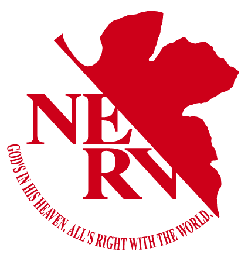

<div align="center">
    
    <h1>Nerv</h1>

[**Quick Start**](#quick-start) | [**Contributing**](#contributing) | [**License**](#license)

</div>

> [!IMPORTANT]
> Nerv is in early alpha and still in development; breaking bugs and missing features should be expected.

## Quick Start

```bash
cargo build
echo "print(\"Hello, Nerv!\");" | cargo run --quiet
```

A basic showcase is in the [**Showcase**](./examples/showcase.nerv) file.

## Contributing

Contributions are welcome, but please make sure you clarify with me before submitting a pull request. You can contact me via my discord `_nonnewport_`.

## License

Nerv is distributed under the [MIT](./LICENSE) license.
